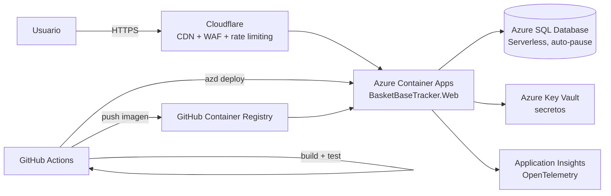

# Arquitectura

Este fichero recoge las decisiones de arquitectura de BasketBaseTracker, derivadas de los requisitos descritos en [`functional.md`](./functional.md), el [`data-model.md`](./data-model.md) y el [`screens.md`](./screens.md).

## Contexto

El proyecto lo desarrolla y mantiene una única persona, sin presupuesto, con una carga esperada moderada y muy estacional (picos los fines de semana durante la temporada, prácticamente inactivo el resto). Estas condiciones guían todas las decisiones siguientes: se prioriza la simplicidad operativa y un único lenguaje (C#/.NET) de extremo a extremo, frente a arquitecturas más sofisticadas que exigirían más tiempo de mantenimiento del que hay disponible.

## Diagrama de despliegue



## Decisiones de arquitectura

### 1. Backend y frontend

**Decisión**: .NET 10 + ASP.NET Core, con Razor Pages para toda la interfaz (pública y administración). Sin Blazor ni SPA (React/Vue/Angular).

**Justificación**: un único lenguaje de extremo a extremo reduce la carga cognitiva para un desarrollador en solitario sin experiencia previa en frontend. Razor Pages es HTTP sin estado, lo que encaja con el hosting serverless (Container Apps escalando a cero) y con el Output Caching necesario para cumplir los 200ms de latencia. Se descartó Blazor Server porque su conexión SignalR persistente por usuario es mala pareja del escalado a cero y de picos de 500 usuarios concurrentes; se descartó una SPA separada porque exigiría API + gestión de tokens + CORS + build de JS sin que el documento funcional pida ninguna interacción rica en tiempo real.

### 2. Organización del código

**Decisión**: un único proyecto web con Areas de ASP.NET Core (`Public` y `Admin`), sin capas adicionales tipo Clean Architecture.

**Justificación**: separa las rutas públicas (cacheables, anónimas) de las administrativas (autenticadas, sin caché) sin necesidad de desplegar dos aplicaciones distintas. Si en el futuro conviene aislar el admin en otro servicio, es un refactor limpio porque ya está separado por Area. No se adopta una arquitectura por capas desde el inicio porque el proyecto no lo necesita todavía; puede evolucionar si crece.

### 3. Persistencia de datos

**Decisión**: Azure SQL Database, tier Serverless (auto-pause), con EF Core como ORM.

**Justificación**: EF Core parametriza las consultas por defecto (mitiga inyección SQL), tiene scaffolding integrado que genera CRUD para las entidades del modelo de datos (ahorra construir a mano las pantallas de `screens.md`), e integra bien con Aspire y con Azure. El tier Serverless con auto-pause encaja con una carga muy estacional y con la aceptación explícita de arranques en frío recogida en `functional.md`.

### 4. Hosting y escalado

**Decisión**: Azure Container Apps, plan de consumo (escala a cero).

**Justificación**: escala a cero entre jornadas y hasta los picos de 300 RPS en días de partido sin gestión de servidores, con una capa gratuita generosa (180.000 vCPU-s y 360.000 GiB-s al mes). Permite ejecutar una aplicación ASP.NET Core "normal" en contenedor, en vez de descomponerla en funciones individuales (Azure Functions), lo que simplifica notablemente la superficie de administración con tantas pantallas de gestión.

**Riesgo a vigilar**: si se escala horizontalmente en picos, hay que controlar el pool de conexiones de EF Core para no agotar las conexiones de Azure SQL Serverless. Con la carga esperada (500 usuarios concurrentes) no debería ser un problema, pero conviene tenerlo en el radar.

### 5. Caché y rendimiento

**Decisión**: Output Caching de ASP.NET Core en las páginas públicas + Cloudflare (plan gratuito) como CDN/proxy delante de Container Apps.

**Justificación**: el requisito de consistencia eventual (máximo 5 minutos) permite cachear agresivamente calendarios, resultados y clasificaciones, que es la palanca principal para cumplir los 200ms de latencia. Cloudflare añade una capa de caché en el edge y reduce la carga que llega a Container Apps.

### 6. Seguridad

**Decisión**:
- Inyección SQL: mitigada por defecto por EF Core (consultas parametrizadas).
- XSS: mitigado por defecto por el motor de vistas Razor (escapado automático de HTML).
- DoS: Cloudflare (WAF básico + rate limiting + protección DDoS en el edge, plan gratuito) delante de la aplicación, más el middleware de rate limiting nativo de ASP.NET Core en los endpoints de escritura del área de administración.
- Secretos: cadena de conexión y demás credenciales gestionadas con Managed Identity + Azure Key Vault, en vez de variables de entorno en claro.

**Justificación**: cubre directamente los tres vectores que exige el documento funcional (inyección SQL, XSS, DoS) apoyándose en su mayoría en comportamientos por defecto del framework, sin componentes adicionales que mantener.

### 7. Autenticación y autorización

**Decisión**: ASP.NET Core Identity con autenticación por cookies. Los usuarios anónimos no requieren autenticación (consultas públicas); los administradores sí. El modelo de roles se deja preparado para poder desglosarse en el futuro (gestor de competiciones, de equipos, de resultados...), aunque en la v1 existe un único rol de administrador.

### 8. Observabilidad

**Decisión**: SDK de OpenTelemetry para .NET, configurado a través del proyecto `ServiceDefaults` de Aspire (auto-instrumentación de ASP.NET Core y EF Core, health checks y resiliencia vía Polly), exportando a Azure Monitor / Application Insights.

**Justificación**: cumple el requisito explícito de observabilidad basada en OpenTelemetry del documento funcional. Se elige Application Insights como backend porque ya se está en Azure (integración prácticamente automática, capa gratuita de 5GB/mes) y evita gestionar una cuenta adicional en un proveedor externo (Grafana Cloud, Honeycomb...).

### 9. Calendario iCal

**Decisión**: librería `Ical.Net` para generar feeds `.ics` por competición y por equipo.

**Justificación**: Google Calendar y otros clientes pueden suscribirse directamente a una URL `.ics`, lo que satisface el requisito de publicar el calendario en formato iCal/Google Calendar sin necesidad de integrar la API de Google Calendar.

### 10. Importación/exportación

**Decisión**: un único endpoint de exportación e importación **completa** de todos los datos del sistema (no parcial por entidad), en formato JSON, accesible solo a administradores del sistema.

**Justificación**: su propósito no es la gestión de datos del día a día (para eso están las pantallas de administración de `screens.md`), sino servir de backup y de vía de migración a otra plataforma si en algún momento fuera necesario, tal como se acordó explícitamente.

### 11. Infraestructura como código

**Decisión**: .NET Aspire (`AppHost` + `ServiceDefaults`) como modelo de orquestación local y generador de Bicep, desplegado con `azd` (Azure Developer CLI).

**Justificación**: permite declarar la topología (Web, Azure SQL, Key Vault...) en C#, un único lenguaje también para la infraestructura. En desarrollo local, Aspire levanta contenedores equivalentes con un dashboard de logs/trazas/métricas en vivo, algo que Bicep por sí solo no ofrece. El Bicep resultante se genera automáticamente en vez de escribirse a mano, aunque queda versionado en el repositorio (`infra/`) para poder revisarlo.

**Riesgo a vigilar**: Aspire es un framework relativamente joven; conviene revisar los cambios entre versiones antes de actualizar.

### 12. Registro de contenedores

**Decisión**: GitHub Container Registry (`ghcr.io`), usando el soporte de Aspire para registros externos (`AddContainerRegistry` + `WithContainerRegistry`), en vez del Azure Container Registry que `azd` provisiona por defecto.

**Justificación**: mantiene el compromiso de "solo infraestructura gratuita" del documento funcional — Azure Container Registry tiene un coste fijo (~5$/mes) que GHCR evita.

**Riesgos a vigilar**:
- La API `AddContainerRegistry`/`WithContainerRegistry` es experimental en Aspire (diagnóstico `ASPIRECOMPUTE003`), puede cambiar en futuras versiones.
- A diferencia de ACR, la autenticación contra GHCR no está integrada automáticamente con Container Apps: hay que gestionar las credenciales manualmente (`docker login` en local, secreto en GitHub Actions para CI/CD) y ajustar a mano la parte del Bicep generado que conecta el Container App con el registro externo.

### 13. CI/CD

**Decisión**: GitHub Actions — build, tests, publicación de la imagen en GHCR y despliegue a Container Apps vía `azd`. Se parte del workflow base que genera `azd pipeline config` y se amplía con los pasos de test.

### 14. Clasificación como dato derivado

**Decisión**: la clasificación (`ClasificacionEquipo` en `data-model.md`) se mantiene como una tabla de caché recalculada a partir de los partidos, no como fuente de verdad editable.

**Justificación**: el requisito de consistencia eventual (máximo 5 minutos) permite tratarla como una caché, y la clave `CompeticionId` sirve de partición natural tanto para el recálculo como para el cacheo de las consultas públicas.

## Estructura de la solución

```
src/BasketBaseTracker.AppHost/          # Orquestación Aspire: dev local + modelo de despliegue azd
src/BasketBaseTracker.ServiceDefaults/  # OpenTelemetry, health checks, resiliencia compartidos
src/BasketBaseTracker.Web/              # Razor Pages, Areas Public/Admin, EF Core, servicios
tests/BasketBaseTracker.Tests/          # Unitarios (p. ej. cálculo de clasificación) e integración (EF Core)
infra/                                  # Bicep generado por Aspire/azd, versionado en el repo
.github/workflows/                      # CI/CD
```

## Pendiente de definir

- Política de retención/archivado de temporadas finalizadas (ya pendiente en `data-model.md`).
- Roles administrativos granulares más allá del rol único de administrador de la v1.
- Estrategia y cobertura mínima de pruebas.
- Validar en el momento de implementar si el soporte de Aspire para GHCR sigue funcionando igual, dado su carácter experimental.
