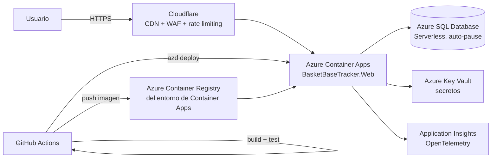

# Arquitectura

Este fichero recoge las decisiones de arquitectura de BasketBaseTracker, derivadas de los requisitos descritos en [`functional.md`](./functional.md), el [`data-model.md`](./data-model.md) y el [`screens.md`](./screens.md).

## Contexto

El proyecto lo desarrolla y mantiene una única persona, sin presupuesto, con una carga esperada moderada y muy estacional (picos los fines de semana durante la temporada, prácticamente inactivo el resto). Estas condiciones guían todas las decisiones siguientes: se prioriza la simplicidad operativa y un único lenguaje (C#/.NET) de extremo a extremo, frente a arquitecturas más sofisticadas que exigirían más tiempo de mantenimiento del que hay disponible.

## Diagrama de despliegue



## Decisiones de arquitectura

### 1. Backend y frontend

**Decisión**: .NET 10 + ASP.NET Core, con Razor Pages para toda la interfaz (pública y administración). Sin Blazor ni SPA (React/Vue/Angular).

**Justificación**: un único lenguaje de extremo a extremo reduce la carga cognitiva para un desarrollador en solitario sin experiencia previa en frontend. Razor Pages es HTTP sin estado, lo que encaja con el hosting serverless (Container Apps escalando a cero) y con el Output Caching necesario para cumplir los 200ms de latencia. Se descartó Blazor Server porque su conexión SignalR persistente por usuario es mala pareja del escalado a cero y de picos de 500 usuarios concurrentes; se descartó una SPA separada porque exigiría API + gestión de tokens + CORS + build de JS sin que el documento funcional pida ninguna interacción rica en tiempo real.

### 2. Organización del código

**Decisión**: un único proyecto web con Areas de ASP.NET Core (`Public` y `Admin`), sin capas adicionales tipo Clean Architecture.

**Justificación**: separa las rutas públicas (cacheables, anónimas) de las administrativas (autenticadas, sin caché) sin necesidad de desplegar dos aplicaciones distintas. Si en el futuro conviene aislar el admin en otro servicio, es un refactor limpio porque ya está separado por Area. No se adopta una arquitectura por capas desde el inicio porque el proyecto no lo necesita todavía; puede evolucionar si crece.

### 3. Persistencia de datos

**Decisión**: Azure SQL Database, tier Serverless (auto-pause), con EF Core como ORM.

**Justificación**: EF Core parametriza las consultas por defecto (mitiga inyección SQL), tiene scaffolding integrado que genera CRUD para las entidades del modelo de datos (ahorra construir a mano las pantallas de `screens.md`), e integra bien con Aspire y con Azure. El tier Serverless con auto-pause encaja con una carga muy estacional y con la aceptación explícita de arranques en frío recogida en `functional.md`.

### 4. Hosting y escalado

**Decisión**: Azure Container Apps, plan de consumo (escala a cero).

**Justificación**: escala a cero entre jornadas y hasta los picos de 300 RPS en días de partido sin gestión de servidores, con una capa gratuita generosa (180.000 vCPU-s y 360.000 GiB-s al mes). Permite ejecutar una aplicación ASP.NET Core "normal" en contenedor, en vez de descomponerla en funciones individuales (Azure Functions), lo que simplifica notablemente la superficie de administración con tantas pantallas de gestión.

**Riesgo a vigilar**: si se escala horizontalmente en picos, hay que controlar el pool de conexiones de EF Core para no agotar las conexiones de Azure SQL Serverless. Con la carga esperada (500 usuarios concurrentes) no debería ser un problema, pero conviene tenerlo en el radar.

### 5. Caché y rendimiento

**Decisión**: Output Caching de ASP.NET Core en las páginas públicas + Cloudflare (plan gratuito) como CDN/proxy delante de Container Apps. Invalidación **solo por expiración (TTL)**, sin purga activa al escribir.

- **TTL**: duración de caché ligeramente por debajo del límite de `functional.md`, p. ej. 4 minutos, dejando margen para la propagación entre el Output Cache de origen y el edge de Cloudflare. Se aplica de forma uniforme a las páginas públicas cubiertas por el requisito de consistencia eventual (calendarios, resultados, clasificación); páginas que cambian con menos frecuencia (ficha de equipo, de club, de sede) pueden compartir el mismo TTL por simplicidad, sin necesidad de una política distinta por tipo de página.
- **Sin purga activa**: no se invalida caché por tags ni se llama a la API de Cloudflare al guardar un partido. El área Admin ya se sirve sin caché (punto 2), así que el propio administrador ve su cambio al instante; el público puede tardar hasta el TTL en verlo, lo cual es exactamente el margen que permite `functional.md`. Se descarta la purga activa por la misma razón que en el punto 14: nada que invalidar es más simple y más difícil de dejar inconsistente que invalidar correctamente en cada camino de escritura (edición, deshacer, importación masiva).
- **Cloudflare — necesario configurar una Cache Rule explícita**: en el plan gratuito, Cloudflare no cachea `text/html` en el edge por defecto aunque el origen envíe `Cache-Control: max-age=...` — hace falta una Cache Rule tipo "Cache Everything" que respete el `Cache-Control` del origen, con alcance a las rutas públicas y excluyendo explícitamente `/Admin/*` como defensa adicional (aunque esas rutas ya viajan con `Cache-Control: no-store` desde el origen).
- **Partición**: el Output Caching varía por ruta (`VaryByRouteValue` sobre `competicionId`, `equipoId`, etc., según la página), que es el comportamiento por defecto — no hace falta una clave de caché manual.

**Justificación**: el requisito de consistencia eventual (máximo 5 minutos) permite cachear agresivamente calendarios, resultados y clasificaciones, que es la palanca principal para cumplir los 200ms de latencia. Cloudflare añade una capa de caché en el edge y reduce la carga que llega a Container Apps. Resolver la invalidación con TTL en vez de purga activa evita gestionar un secreto adicional (token de la API de Cloudflare) y una categoría entera de bugs de sincronización, a cambio de una latencia de propagación que el propio documento funcional ya acepta.

**Mejora futura**: si el TTL dejara de ser suficiente, hay una alternativa de purga activa registrada en `## Mejoras futuras` (MF-1).

### 6. Seguridad

**Decisión**:
- Inyección SQL: mitigada por defecto por EF Core (consultas parametrizadas).
- XSS: mitigado por defecto por el motor de vistas Razor (escapado automático de HTML).
- DoS: Cloudflare (WAF básico + rate limiting + protección DDoS en el edge, plan gratuito) delante de la aplicación, más el middleware de rate limiting nativo de ASP.NET Core (`Microsoft.AspNetCore.RateLimiting`) en dos puntos concretos:
  - Endpoints de escritura del área Admin (crear/editar/eliminar): límite fijo por usuario autenticado (partición por `UserId`), holgado para uso manual normal — p. ej. 60 peticiones/minuto — pensado para frenar un script o una sesión comprometida, no el uso legítimo desde la UI.
  - Endpoint de login: límite más estricto por IP (p. ej. 5 intentos / 15 minutos), que se solapa con el bloqueo de cuenta de ASP.NET Core Identity (ver punto 7) como segunda barrera contra fuerza bruta.
- Secretos: credenciales gestionadas con Azure Key Vault (accedido vía Managed Identity), en vez de variables de entorno en claro. La cadena de conexión a Azure SQL es la excepción: usa autenticación SQL (login + contraseña, esta última como secreto de Aspire expuesto como secreto del propio Container App, no en claro), no Managed Identity — revertido durante el primer despliegue de `BAS-3` por un bug de la plataforma (ver `spec.md` de `BAS-3`, "¿Se puede seguir usando Managed Identity para Azure SQL?"). El login de `Web` tiene privilegios mínimos (lectura/escritura, sin DDL), distinto del login admin usado solo para aprovisionarlo.

**Justificación**: cubre directamente los tres vectores que exige el documento funcional (inyección SQL, XSS, DoS) apoyándose en su mayoría en comportamientos por defecto del framework, sin componentes adicionales que mantener.

### 7. Autenticación y autorización

**Decisión**: ASP.NET Core Identity con autenticación por cookies. Los usuarios anónimos no requieren autenticación (consultas públicas); los administradores sí. El modelo de roles se deja preparado para poder desglosarse en el futuro (gestor de competiciones, de equipos, de resultados...), aunque en la v1 existe un único rol de administrador.

- **Sin autorregistro**: no hay pantalla pública de alta de administrador. La primera cuenta de sistema se crea mediante un paso de *seed* idempotente (al arranque o como parte del pipeline de despliegue: si no existe ningún administrador, se crea uno a partir de credenciales guardadas en Key Vault). A partir de ahí, cualquier administrador adicional se da de alta desde la propia pantalla de gestión de usuarios del área Admin, por un administrador ya existente.
- **Sin confirmación por email**: al no haber autorregistro, se desactiva el flujo de confirmación de email que trae Identity por defecto — evita añadir un proveedor de envío de correo (SendGrid, SMTP...) que no aportaría nada dado que las cuentas ya nacen de confianza.
- **Contraseña y bloqueo de cuenta**: política de contraseña algo más estricta que el valor por defecto de Identity (longitud mínima 12 en vez de 8, razonable al ser pocas cuentas) + bloqueo de cuenta tras intentos fallidos (valor por defecto de Identity: 5 intentos, 5 minutos de bloqueo), que se combina con el rate limiting del endpoint de login (punto 6) como segunda barrera.
- **Sin 2FA obligatorio en v1**: el área admin gestiona datos de competición sin datos personales ni pagos (`functional.md`), así que el impacto de una cuenta comprometida es moderado y recuperable (vandalizar resultados/calendarios). Alternativa registrada en `## Mejoras futuras` (MF-5) si el número de administradores o el riesgo percibido crece.

**Justificación**: cookies + Identity es la integración más directa con Razor Pages sin estado adicional (encaja con el hosting serverless del punto 4), y evita construir a mano gestión de sesiones o traer un proveedor externo de identidad para un puñado de administradores de confianza.

### 8. Observabilidad

**Decisión**: SDK de OpenTelemetry para .NET, configurado a través del proyecto `ServiceDefaults` de Aspire (auto-instrumentación de ASP.NET Core y EF Core, health checks y resiliencia vía Polly), exportando a Azure Monitor / Application Insights.

- **Logs**: `ILogger` con mensajes estructurados (message templates, nunca interpolación de strings). `Information` para eventos de negocio relevantes (alta/edición de partidos y resultados, importación/exportación completa); `Warning` para degradación o reintentos de Polly; `Error` para excepciones no controladas. Nunca se loguean secretos, cadenas de conexión ni cualquier dato cubierto por el requisito de RGPD.
- **Trazas**: auto-instrumentación de ASP.NET Core y EF Core (ya provista por `ServiceDefaults`), más `ActivitySource` propio para operaciones de negocio no triviales: recálculo de clasificación, importación/exportación completa, generación del feed iCal. El contexto de traza de OpenTelemetry ya correla logs/trazas/métricas entre sí, sin necesidad de un correlation ID manual.
- **Métricas**: las automáticas de la auto-instrumentación (latencia y tasa de error por endpoint) más métricas custom con `System.Diagnostics.Metrics` (`Meter`) para: duración del recálculo de clasificación, resultado de import/export (éxito/fallo), y *cache hit/miss* del Output Caching (no expuesto por defecto; requiere instrumentación manual en el middleware).
- **Alertas**: reglas de Azure Monitor sobre Application Insights, ligadas directamente a los NFR de `functional.md`: latencia p95 > 200ms sostenida en calendario/resultados/clasificación, tasa de error > 0,5% en esos mismos endpoints, y fallo de health checks. Canal de notificación: email, sin coste adicional y suficiente para un único administrador de sistema. No son un recurso de primera clase de Aspire (no hay un `AddAzureMonitorAlert` equivalente a `AddAzureApplicationInsights`) — se configuran directamente en Azure una vez provisionados los recursos (portal o `az monitor`), no desde `AppHost.cs`.
- **Dashboard**: Dashboards con Grafana integrados en Application Insights (experiencia nativa del propio recurso, sin cuenta ni servicio externo, sin coste adicional sobre la capa gratuita ya usada) — no el *Aspire Dashboard* desplegado en Azure Container Apps, pensado para desarrollo (ligero, sin persistencia ni configuración) y no para el uso continuado que necesita producción. Se configura directamente en Azure sobre el recurso de Application Insights ya provisionado, igual que las alertas.
- **Disponibilidad (99,5%)**: sin sonda sintética activa por ahora, para mantener el compromiso de "solo infraestructura gratuita" (ver punto 12) — los Availability Tests de Azure Monitor tienen un coste por ejecución. Se vigila de forma reactiva a través de las métricas de error/latencia y del fallo de health checks ya descritos. Alternativa registrada en `## Mejoras futuras` (MF-3) si hiciera falta monitorización activa de uptime.
- **Retención y coste**: capa gratuita de Application Insights (5GB/mes, 90 días de retención) debería bastar para la carga estacional esperada; el SDK aplica *adaptive sampling* por defecto para no agotar la cuota en los picos de los días de partido.

**Justificación**: cumple el requisito explícito de observabilidad basada en OpenTelemetry del documento funcional y da trazabilidad directa a los NFR medibles (latencia, tasa de error, disponibilidad) sin añadir componentes ni cuentas más allá de las ya decididas. Se elige Application Insights como backend porque ya se está en Azure (integración prácticamente automática, capa gratuita de 5GB/mes) y evita gestionar una cuenta adicional en un proveedor externo (Grafana Cloud, Honeycomb...).

### 9. Calendario iCal

**Decisión**: librería `Ical.Net` para generar feeds `.ics` por competición y por equipo.

**Justificación**: Google Calendar y otros clientes pueden suscribirse directamente a una URL `.ics`, lo que satisface el requisito de publicar el calendario en formato iCal/Google Calendar sin necesidad de integrar la API de Google Calendar.

### 10. Importación/exportación

**Decisión**: un único endpoint de exportación e importación **completa** de todos los datos del sistema (no parcial por entidad), en formato JSON, accesible solo a administradores del sistema.

- **Modo de importación: reemplazo completo**, no fusión/upsert. Importar borra todos los datos actuales y carga los del fichero, como una restauración — encaja con el propósito de backup/migración (no es una herramienta de sincronización) y es mucho más simple de razonar y testear que resolver fusiones, huérfanos o relaciones que desaparecen del fichero.
- **Salvaguardas**, dado lo destructivo del reemplazo completo: confirmación explícita del administrador antes de ejecutar (no un único clic) y **backup automático del estado actual** justo antes de reemplazar — se reutiliza el propio endpoint de exportación internamente, devolviendo o conservando ese fichero, así siempre hay una vía de deshacer una importación equivocada.
- **Versionado del formato**: el JSON incluye un campo de versión de esquema en la raíz. La importación rechaza (sin aplicar nada) cualquier fichero cuya versión no sea la soportada por la versión desplegada de la aplicación, en vez de intentar una importación parcial o "mejor esfuerzo" con un esquema desalineado.
- **Validación antes de aplicar**: el fichero completo se parsea y se valida (integridad referencial entre entidades del fichero, invariantes de negocio como "un equipo no puede aparecer dos veces en la misma jornada" de `data-model.md`) antes de tocar la base de datos. Solo si todo el fichero es válido se aplica el reemplazo dentro de una única transacción — todo o nada, coherente con el requisito de `functional.md` de que las operaciones administrativas sean atómicas.
- **Alcance de entidades**: todas las entidades catálogo y transaccionales de `data-model.md`. La clasificación queda fuera del fichero — al ser una consulta calculada y no una tabla (punto 14), no hay nada que exportar ni importar; se recalcula sola a partir de los `Partido` importados en cuanto se consulta.

**Justificación**: su propósito no es la gestión de datos del día a día (para eso están las pantallas de administración de `screens.md`), sino servir de backup y de vía de migración a otra plataforma si en algún momento fuera necesario, tal como se acordó explícitamente.

### 11. Infraestructura como código

**Decisión**: .NET Aspire (`AppHost` + `ServiceDefaults`) como modelo de orquestación local, desplegado con `aspire deploy` (o `azd` como alternativa) sin comprometer Bicep generado en el repositorio.

**Justificación**: permite declarar la topología (Web, Azure SQL, Key Vault...) en C#, un único lenguaje también para la infraestructura. En desarrollo local, Aspire levanta contenedores equivalentes con un dashboard de logs/trazas/métricas en vivo, algo que Bicep por sí solo no ofrece. Por defecto, tanto `aspire deploy` como `azd provision`/`azd deploy` generan el Bicep **en memoria** en el momento del despliegue a partir del modelo de `AppHost.cs` — no se escribe a disco ([documentación oficial](https://learn.microsoft.com/dotnet/aspire/deployment/azd/aca-deployment-azd-in-depth#how-azure-developer-cli-integration-works)). `AppHost.cs`, ya versionado, es la fuente real de infraestructura como código; no hace falta comprometer el Bicep resultante para tener el despliegue reproducible y revisable en el repositorio. Materializarlo a disco (`azd infra gen`) es un paso aparte, explícito y opcional, pensado para cuando hace falta personalizar recursos más allá de lo que expone la API de Aspire (`ConfigureInfrastructure`) — y una vez generado, deja de sincronizarse solo con `AppHost.cs`: hay que recordar regenerarlo (sobrescribiendo cualquier personalización manual) cada vez que cambia el modelo. No se usa en este proyecto salvo que una necesidad concreta lo justifique.

**Riesgo a vigilar**: Aspire es un framework relativamente joven; conviene revisar los cambios entre versiones antes de actualizar.

### 12. Registro de contenedores

**Decisión**: el Azure Container Registry (Basic) que `AddAzureContainerAppEnvironment` aprovisiona automáticamente para el entorno de Container Apps — sin registro externo (GHCR) ni configuración adicional en el `AppHost`.

**Historial**: la decisión original (propuesta en `BAS-3`) era usar GitHub Container Registry (`ghcr.io`) vía `AddContainerRegistry` + `WithContainerRegistry`, para evitar el coste fijo de ACR (~5$/mes) y mantener el compromiso de "solo infraestructura gratuita" del documento funcional. Revertida tras comprobar en la práctica (`aspire deploy --list-steps`) que **`AddAzureContainerAppEnvironment` aprovisiona su propio ACR de todos modos** para la identidad administrada del entorno, se use o no ese registro para las imágenes de las apps — confirmado también en la documentación oficial de Aspire ("*Compute environments such as AzureContainerAppEnvironment automatically provision a default Azure Container Registry when none is specified*"). No existe, a fecha de Aspire 13.4.6, ninguna combinación de APIs que permita un entorno **nuevo** sin ACR asociado; la única combinación que lo evita (`AsExisting` sobre entorno, ACR e identidad) exige que las tres piezas ya existan aprovisionadas fuera de Aspire, lo cual no aplica a este proyecto.

**Justificación**: dado que el ACR es inevitable con Azure Container Apps, usar GHCR además no reduce el coste — solo añade un registro más que gestionar (credenciales, `docker login`, ajustes manuales al Bicep generado). Se acepta el ACR por defecto como excepción documentada al principio de "solo infraestructura gratuita": es un coste fijo pequeño (~5$/mes) inherente a la plataforma de cómputo elegida (punto 3), no a una elección de registro evitable.

**Riesgo a vigilar**: si en el futuro Aspire permite desacoplar el ACR del entorno (o se cambia de plataforma de cómputo — ver punto 3), reevaluar esta decisión.

### 13. CI/CD

**Decisión**: GitHub Actions — build, tests, publicación de la imagen en el Azure Container Registry del entorno de Container Apps (punto 12) y despliegue a Container Apps vía `azd`. Se parte del workflow base que genera `azd pipeline config` y se amplía con los pasos de test: unitarios e integración en cada push/PR (bloquean el merge si fallan), smoke E2E solo en el workflow de despliegue a producción, antes de promocionar la imagen (ver punto 15).

- **Entornos**: uno solo, producción, mapeado a la rama `main`. `develop` y las ramas `feature/BAS-N` no despliegan a ningún entorno en la nube — se validan con los tests de CI (punto 15) y con Aspire en local. Evita el coste recurrente de una segunda base de datos.
- **Etiquetado de imágenes**: cada imagen se etiqueta con el SHA corto del commit de `main` que la generó, para trazabilidad exacta entre imagen desplegada y código; sin depender de un tag móvil tipo `latest`.
- **Migraciones de base de datos**: se aplican como un paso explícito del pipeline (`dotnet ef database update`) antes de desplegar la nueva revisión del Container App, en una única ejecución controlada — no al arrancar cada instancia de la aplicación, para evitar que varias réplicas intenten migrar a la vez en un pico de tráfico.
- **Despliegue y rollback**: Container Apps en modo de revisiones múltiples (`Multiple` revision mode); cada despliegue crea una revisión nueva con el 100% del tráfico, sin desactivar la anterior. Revertir un despliegue problemático es un cambio manual de tráfico a la revisión previa, sin reconstruir ni redesplegar nada — coste cero, porque una revisión inactiva en un plan de consumo no consume recursos.
- **Rollback de esquema**: sin estrategia de down-migration automatizada; si una migración desplegada resulta problemática, se corrige hacia delante con una nueva migración, no revirtiendo la anterior.

**Mejora futura**: entorno de staging — descartado por ahora, registrado en `## Mejoras futuras` (MF-4).

### 14. Clasificación como consulta calculada

**Decisión**: no existe una tabla `ClasificacionEquipo`. La clasificación se calcula al vuelo agregando `Partido` (estado `Jugado` o `Resuelto`, en jornadas con `CuentaParaClasificacion = true` — ver `data-model.md` y punto 16) por `EquipoId` dentro de una `CompeticionId`, restando además las `PenalizacionClasificacion` vigentes de cada equipo (descuentos de puntos por expediente disciplinario — ver `data-model.md`), en un servicio de dominio sin estado propio, y se sirve a través del mismo Output Caching que el resto de consultas públicas (punto 5).

**Nota de secuenciación**: `PenalizacionClasificacion` es de las últimas piezas previstas para implementarse (su gestión administrativa depende de un expediente disciplinario, algo infrecuente) — el cálculo base de la clasificación se puede construir y testear primero asumiendo cero penalizaciones, y sumar ese término después sin rediseñar nada.

**Cómo se llegó aquí**: la primera propuesta fue una tabla de caché (`ClasificacionEquipo`) recalculada por completo y de forma síncrona en la misma transacción cada vez que se guardaba un partido de esa competición. Se descartó porque introduce una carrera real: dos administradores editando partidos distintos de la misma competición en paralelo pueden leer `Partido` antes de que el otro haga commit y, al escribir, el segundo sobreescribe el resultado del primero con un cálculo que no incluye su cambio (*lost update*) — los locks de fila en la escritura serializan quién graba último, pero no lo que cada uno leyó antes. El cálculo al vuelo elimina el problema de raíz: no hay estado derivado que sincronizar, cada lectura agrega lo que esté confirmado en ese instante. A este volumen (8-14 equipos, unos pocos cientos de partidos por competición y temporada) la agregación es trivial para SQL Server, así que el argumento clásico a favor de materializar (evitar recalcular en cada lectura) no compensa la complejidad de mantenerlo sincronizado.

**Criterios de desempate**: siguen el Reglamento General y de Competiciones de la F.A.B. (Art. 84-85; ver [`reglamento/resumen-reglas-relevantes.md`](./reglamento/resumen-reglas-relevantes.md#3-desempates-en-la-clasificación-fab-art-8485)), que define dos conjuntos de criterios distintos según la fase de la competición:

- Hasta el final de la primera vuelta (en ligas a doble vuelta): diferencia general de tantos → cociente general de tantos → puntos entre los empatados → diferencia de tantos entre los empatados → cociente de tantos entre los empatados.
- Desde el inicio de la segunda vuelta y en Campeonatos de Andalucía: puntos entre los empatados → diferencia de tantos entre ellos → tantos a favor entre ellos → diferencia general → tantos a favor general. Un equipo con una sanción de 2-0 en contra ocupa siempre la última posición entre los empatados con él.
- Determinar automáticamente si una competición está "en primera vuelta" o no es un detalle de implementación no resuelto aún (podría inferirse de `Jornada.Numero` frente al total de jornadas de liga regular, o marcarse explícitamente) — pendiente para cuando se implemente esta lógica, no bloquea el resto del modelo.

**Justificación**: el requisito de consistencia eventual (máximo 5 minutos) de `functional.md` permite servir la clasificación desde caché de lectura en vez de mantener un estado persistido, y `CompeticionId` sirve de partición natural tanto de la consulta como de la caché para cumplir el límite de 200ms. Además simplifica la escritura: guardar/editar/eliminar un partido vuelve a ser una operación de una sola entidad, sin lógica transversal que recordar invocar desde cada camino de escritura (edición, deshacer, importación masiva).

**Mejora futura**: si el cálculo al vuelo dejara de ser viable, hay dos alternativas registradas en `## Mejoras futuras` (MF-2).

### 15. Estrategia de pruebas

**Decisión**: tres niveles de test, con `xUnit v3` como framework en los dos primeros y sin librería de mocking adicional (la lógica o es pura y se testea directo, o toca EF Core y se testea con dependencias reales):

- **Unitarios** (`tests/BasketBaseTracker.Tests/Unit/`): lógica de dominio pura sin I/O — cálculo de la clasificación (punto 14), validaciones de negocio (aplazamientos, incomparecencias, alineación indebida, fechas de jornada), generación del feed iCal. Sin base de datos, se ejecutan en segundos.
- **Integración** (`tests/BasketBaseTracker.Tests/Integration/`): Razor Pages + EF Core contra base de datos real, usando `Aspire.Hosting.Testing` (`DistributedApplicationTestingBuilder`) para levantar el mismo `AppHost` de desarrollo local (Web + Azure SQL en contenedor) dentro del test. Se reutiliza así la orquestación ya decidida en el punto 11 en vez de introducir una herramienta adicional (p. ej. Testcontainers directo) que resolvería lo mismo por otro camino. Cubre CRUD de administración (incluida autorización), consultas públicas cacheadas, export/import JSON y el feed iCal servido por HTTP.
- **E2E** (`tests/BasketBaseTracker.Tests.E2E/`): smoke test mínimo con Playwright sobre un puñado de escenarios críticos de solo lectura (consultar calendario, resultados, clasificación). Proyecto separado porque su ciclo de vida es distinto: no se ejecuta en cada PR, solo antes de desplegar a producción (ver punto 13), dado el coste de mantenimiento de una suite E2E completa frente a los recursos disponibles.

**Cuándo se ejecutan**: unitarios e integración en cada push/PR vía GitHub Actions, bloqueando el merge si fallan; el smoke E2E solo en el paso previo al despliegue a producción. No se fija un umbral de cobertura porcentual; en su lugar, se exige test unitario para toda lógica de negocio nueva y test de integración para cada página/endpoint nuevo.

**Justificación**: da cobertura a los requisitos no funcionales más sensibles del documento funcional (tasa de error <0,5% en calendarios/resultados/clasificación, integridad de operaciones administrativas) sin exigir a un desarrollador en solitario mantener una suite E2E de UI completa.

### 16. Formato de competición y fases finales

**Decisión**: sin campo de "formato" en `Competicion` ni motor de cuadros/brackets. El formato de una competición emerge jornada a jornada: cada `Jornada` tiene una `Etiqueta` de texto libre (p. ej. "Cuartos de Final", "Semifinal vuelta") y un booleano `CuentaParaClasificacion` (`true` por defecto) que decide si sus partidos entran en el cálculo de la clasificación (punto 14).

**Cómo se llegó aquí**: el Reglamento General y de Competiciones de la F.A.B. (Art. 72; ver [`reglamento/resumen-reglas-relevantes.md`](./reglamento/resumen-reglas-relevantes.md)) permite explícitamente que una competición se celebre por copa, por liga a una o más vueltas con o sin play-off, o "por cualquier sistema que establezca la Asamblea General" — y no fija el número de equipos ni la estructura de una fase final (Art. 157 solo regula la logística de organizarla, no su forma). Como el formato varía por competición y temporada sin un patrón fijo, declararlo por adelantado en un campo `Competicion.Formato` no tendría ningún comportamiento que disparar en la aplicación — sería un dato descriptivo sin uso, la clase de campo que la filosofía de simplicidad del proyecto evita. En su lugar, el administrador construye el calendario incrementalmente: crea las jornadas de liga regular igual que siempre, y cuando llega la fase final crea jornadas adicionales etiquetadas y con `CuentaParaClasificacion = false`.

**Justificación**: cubre liga, copa y formatos mixtos con dos campos simples en `Jornada` en vez de modelar una taxonomía cerrada de fases (que tendría que ampliarse cada vez que una competición use una fase no anticipada) o un motor de emparejamientos. Las pantallas públicas existentes (`Calendario de competición`, `Resultados por jornada`, `Resultados por equipo` en `screens.md`) ya listan partidos agrupados por jornada ordenados por `Numero` — no necesitan ningún cambio de forma, solo mostrar `Etiqueta` en vez de "Jornada {Numero}" cuando esté presente.

**Fuera de alcance deliberado**: no hay relación entre partidos de fases distintas (qué semifinal alimenta a qué final), así que no se puede reconstruir automáticamente un cuadro visual de eliminatorias — cada jornada de fase final es una lista plana de partidos, no un árbol. `functional.md` no pide una visualización de cuadro, solo consulta de calendarios/resultados/clasificación, así que no se construye. Alternativa registrada en `## Mejoras futuras` (MF-6) si en el futuro hiciera falta.

### 17. Retención y protección de datos personales

**Decisión**: sin política de retención/archivado para los datos deportivos (temporadas, competiciones, equipos, partidos, resultados de temporadas pasadas) — se conservan indefinidamente como archivo histórico. La única retención relevante en términos de RGPD es la de las cuentas de administrador y la telemetría, ya cubierta por decisiones existentes.

**Cómo se llegó aquí**: `functional.md` pedía "políticas claras" de retención pensando en RGPD, pero el propio documento ya había decidido antes que no se tratan datos personales de jugadores (`FichaJugador` es anónima, solo dorsal y posición — ver `data-model.md`) ni de usuarios públicos (consultas anónimas, sin cuenta). Los únicos datos personales del sistema son el email de las cuentas de administrador (punto 7) y las direcciones IP que pudiera capturar la telemetría (punto 8). Por tanto, no hace falta una política de retención nueva para los datos deportivos — no son datos personales, y conservarlos indefinidamente es además valioso como archivo histórico de la competición, no un pasivo de cumplimiento.

**Justificación**:
- Datos deportivos: sin retención — ver razonamiento anterior. Volumen trivial a largo plazo (unas pocas temporadas más por año, ver punto 14), no hay presión de espacio que justifique un archivado.
- Cuentas de administrador: sin proceso automático de expiración — al ser un grupo pequeño y de confianza (punto 7), la baja de un administrador que deja el cargo es una acción manual de otro administrador, no un job programado.
- Telemetría: retención de 90 días de la capa gratuita de Application Insights (punto 8), con enmascarado de IP por defecto del SDK de Application Insights — no se cambia esa configuración por defecto, que ya es conforme.

## Mejoras futuras

Alternativas a decisiones ya tomadas, evaluadas y descartadas **por ahora** — no son trabajo pendiente ni compromiso de hacerse, sino la traza de "si esta decisión deja de encajar, el camino ya está pensado" para no tener que re-derivarlo desde cero. Cada entrada enlaza desde el punto de la decisión original.

### MF-1. Purga activa de caché (Cloudflare + Output Cache por tags)

Relacionado con el punto 5 (Caché y rendimiento). Si el TTL de ~4 minutos dejara de ser suficiente — por ejemplo, si se necesitara que un resultado se reflejara en el público casi al instante — la purga activa tendría dos partes, porque no son el mismo mecanismo:

1. **Origen (Output Cache de ASP.NET Core)**: soporta invalidación por *tags* de forma nativa; se etiquetarían las páginas por `CompeticionId`/`EquipoId` y se evictarían al guardar el partido correspondiente.
2. **Edge (Cloudflare)**: en el plan gratuito, la purga por *cache-tag* o por prefijo es una función **solo de Enterprise** — el plan gratuito únicamente permite "Purge Everything" (purga todo el sitio, demasiado agresivo) o "Purge by URL" (lista explícita de URLs, hasta 30 por llamada). La implementación tendría que enumerar a mano las URLs afectadas por un cambio de partido (clasificación y calendario de la competición, resultados de ambos equipos, detalle del partido) y llamar a la API de purga de Cloudflare con esa lista, gestionando el token de API como secreto en Key Vault (punto 6). Añade una llamada de red externa síncrona (o asíncrona con reintentos) al camino de guardado de un partido, y un secreto más que rotar — el motivo por el que hoy se descarta.

### MF-2. Clasificación materializada (tabla + lock, o evento de dominio)

Relacionado con el punto 14 (Clasificación como consulta calculada). Si el cálculo al vuelo dejara de ser viable — por ejemplo, si las reglas de puntuación crecieran en complejidad (desempates por enfrentamiento directo, diferencia de puntos) hasta hacer cara la agregación en cada *cache miss*, o si el volumen de datos creciera muy por encima de lo estimado en `functional.md` — las alternativas a evaluar, de menor a mayor complejidad, son:

1. **Tabla `ClasificacionEquipo` materializada, actualizada síncronamente** en cada alta/baja/edición de `Partido`, protegida con un lock pesimista sobre la fila de `Competicion` (p. ej. `SELECT ... WITH (UPDLOCK, HOLDLOCK)` en SQL Server) al inicio de la transacción, que serialice "leer partidos → calcular → escribir clasificación" entre administradores concurrentes de la misma competición. Resuelve la carrera de *lost update* que motivó descartar la tabla materializada la primera vez, sin necesidad de reintentos, a costa de volver a acoplar la escritura de `Partido` a la de `ClasificacionEquipo`.
2. **Evento de dominio `PartidoModificado` + un único consumidor** responsable de mantener `ClasificacionEquipo` actualizada, desacoplando la escritura del partido del recálculo (el consumidor podría, además, procesar eventos de una misma competición en orden para evitar la carrera sin necesidad de locks explícitos). Es la opción más alineada con arquitecturas orientadas a eventos, pero añade infraestructura (cola o *outbox*, un proceso o *handler* adicional) que hoy no se justifica para un proyecto de una sola persona sin la necesidad de rendimiento que la motivaría.

### MF-3. Monitorización activa de uptime

Relacionado con el punto 8 (Observabilidad). Si en el futuro se decide activar monitorización activa de disponibilidad (más allá de la vigilancia reactiva vía métricas de error/latencia y health checks): opción recomendada es un Azure Monitor Availability Test sobre el endpoint `/health`, asumiendo su pequeño coste por ejecución — rompe el compromiso de "solo infraestructura gratuita", pero de forma acotada y predecible; alternativa sin coste pero con una cuenta y proveedor externos adicionales sería un servicio tipo UptimeRobot.

### MF-4. Entorno de staging

Relacionado con el punto 13 (CI/CD). Si en algún momento la validación en local con Aspire y los tests de CI dejaran de dar suficiente confianza antes de desplegar a producción, la alternativa es un segundo Container App + segunda Azure SQL Database para la rama `develop`, desplegado por el mismo pipeline antes de promocionar a `main`. Se descarta por ahora porque introduce un coste recurrente (el almacenamiento de la base de datos de staging tiene un coste mínimo incluso con auto-pause, a diferencia del cómputo) y duplica recursos a gestionar — secretos, migraciones, monitorización — para un proyecto de una sola persona.

### MF-5. 2FA obligatorio para administradores

Relacionado con el punto 7 (Autenticación y autorización). Si el número de administradores creciera, o si el riesgo percibido de una cuenta comprometida aumentara, ASP.NET Core Identity soporta 2FA por TOTP (Google Authenticator y similares) de forma nativa, sin necesidad de un servicio externo. Se descarta obligarlo en v1 por la fricción que añade a un grupo pequeño de administradores voluntarios frente a un impacto de compromiso de cuenta que hoy es moderado y recuperable.

### MF-6. Cuadro visual de eliminatorias

Relacionado con el punto 16 (Formato de competición y fases finales). Si en el futuro se quisiera mostrar un cuadro visual de eliminatorias (qué partido alimenta a cuál, típico de una fase de copa o playoff), haría falta una relación estructural entre partidos que hoy no existe — p. ej. `Partido.SiguientePartidoId` (nullable) apuntando al partido de la ronda siguiente, más la lógica de UI para dibujar el árbol. Se descarta por ahora porque `functional.md` no pide esta visualización (solo consulta de calendarios, resultados y clasificación) y añadiría una relación y una pantalla nuevas para un caso de uso no confirmado.

### MF-7. Roles administrativos granulares

Relacionado con el punto 7 (Autenticación y autorización). `functional.md` apunta a que el rol único de administrador de la v1 podría desglosarse en el futuro en roles más específicos (gestor de competiciones, de equipos, de resultados...). ASP.NET Core Identity soporta roles de forma nativa (más `IdentityRole` y atributos `[Authorize(Roles=...)]`), así que el coste de introducirlos más adelante es bajo. Se descarta definir los roles concretos ahora porque la v1 tiene un único administrador de facto y diseñar una matriz de permisos sin un caso de uso real que la motive sería especular sobre necesidades futuras — contrario a la filosofía de simplicidad del proyecto.

## Estructura de la solución

```
BasketBaseTracker.slnx                  # Formato de solución .slnx (no el .sln clásico)
Directory.Build.props                   # Propiedades MSBuild compartidas (TargetFramework, Nullable, ImplicitUsings)
Directory.Packages.props                # Versiones de paquetes NuGet centralizadas (Central Package Management)
src/BasketBaseTracker.AppHost/          # Orquestación Aspire: dev local + modelo de despliegue azd
src/BasketBaseTracker.ServiceDefaults/  # OpenTelemetry, health checks, resiliencia compartidos
src/BasketBaseTracker.Web/              # Razor Pages, Areas Public/Admin, EF Core, servicios
tests/BasketBaseTracker.Tests/          # Unitarios e integración (xUnit v3, Aspire.Hosting.Testing) — ver punto 15
tests/BasketBaseTracker.Tests.E2E/      # Smoke E2E con Playwright, solo antes de desplegar a producción — ver punto 15
infra/                                  # Bicep generado por Aspire/azd, versionado en el repo
.github/workflows/                      # CI/CD
```

## Pendiente de definir

Ninguno actualmente.
