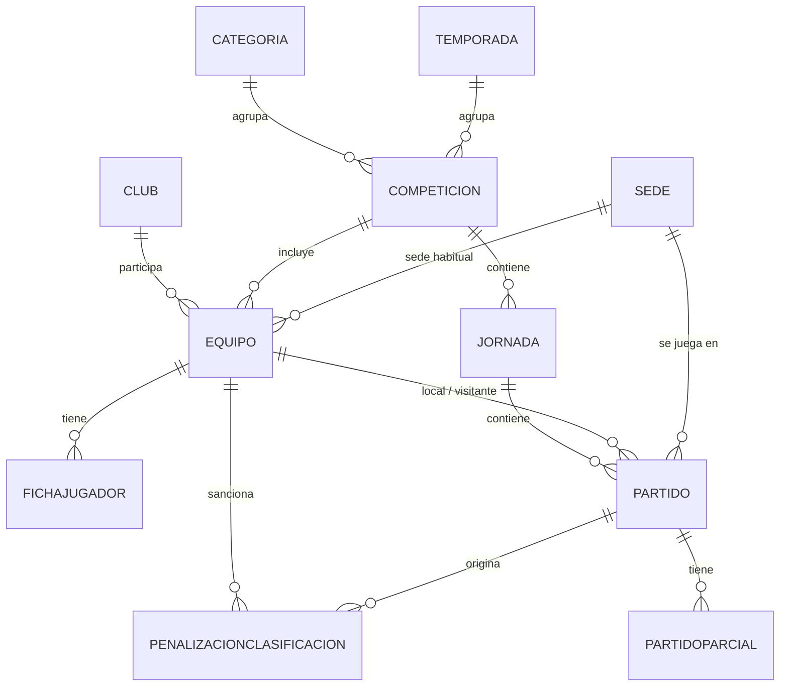

# Modelo de datos

Este fichero describe el modelo de datos de BasketBaseTracker, derivado de los requisitos descritos en [`functional.md`](./functional.md).

## Diagrama de relaciones

## Entidades catálogo (independientes de temporada)

Datos maestros reutilizables entre temporadas.

### Categoria

| Campo | Tipo | Notas |
| --- | --- | --- |
| Id | int (PK) | |
| Nombre | string | Benjamín, Alevín, Infantil, Cadete, Juvenil... |
| Orden | int | Para ordenar por edad en listados |

### Club

| Campo | Tipo | Notas |
| --- | --- | --- |
| Id | int (PK) | |
| Nombre | string | |
| Municipio | string | |
| FechaAlta | date | |

### Sede

| Campo | Tipo | Notas |
| --- | --- | --- |
| Id | int (PK) | |
| Nombre | string | Pabellón municipal |
| Municipio | string | |
| Direccion | string | |

La sede es el pabellón físico y no cambia de una temporada a otra; lo que cambia es qué equipo la usa como sede habitual, y eso se modela en `Equipo`, no aquí.

## Entidades ancladas a temporada

### Temporada

| Campo | Tipo | Notas |
| --- | --- | --- |
| Id | int (PK) | |
| Nombre | string | Ej. "2025-2026" |
| FechaInicio | date | |
| FechaFin | date | |
| Estado | enum | Planificada / EnCurso / Finalizada / Archivada |

### Competicion

| Campo | Tipo | Notas |
| --- | --- | --- |
| Id | int (PK) | |
| TemporadaId | FK → Temporada | |
| CategoriaId | FK → Categoria | |
| PuntosVictoria | int | Por defecto 2 |
| PuntosDerrota | int | Por defecto 1 |

- Restricción única: `(TemporadaId, CategoriaId)` — una competición por categoría y temporada.
- Es la clave de aislamiento de datos por temporada y categoría: toda la información transaccional (equipos, calendario, resultados) cuelga de aquí.
- Los valores por defecto (2/1) son los que fija el Reglamento General y de Competiciones de la F.A.B. para el sistema de liga (Art. 77) — configurables por competición, no fijos en el esquema; ver [`reglamento/resumen-reglas-relevantes.md`](./reglamento/resumen-reglas-relevantes.md).
- Sin campo de "formato" (liga/copa/mixta): el reglamento no fija un formato único de competición (Art. 72), y no hace falta declararlo por adelantado — se construye jornada a jornada mediante `Jornada.Etiqueta` y `Jornada.CuentaParaClasificacion`, ver más abajo. Detalle de esta decisión en [[architecture#16. Formato de competición y fases finales|architecture.md, punto 16]].

### Equipo

Representa la participación de un club en una competición concreta (no es una entidad persistente entre temporadas).

| Campo | Tipo | Notas |
| --- | --- | --- |
| Id | int (PK) | |
| CompeticionId | FK → Competicion | |
| ClubId | FK → Club | |
| Nombre | string | Ej. "CB Triana A" |
| SedeHabitualId | FK → Sede (nullable) | |
| Estado | enum | Activo / Retirado |

- Al ser propio de cada `Competicion` (y por tanto de cada temporada), no hace falta una tabla puente de "inscripción": la fila de `Equipo` **es** la participación de esa temporada.
- Permite varios equipos del mismo club en la misma categoría (A/B).
- No hay vínculo entre el `Equipo` de una temporada y el "mismo" equipo en la temporada siguiente — decisión deliberada de simplicidad recogida en `functional.md`.

### FichaJugador

Sustituye a un "Jugador" como entidad fuerte, por la decisión de no tratar datos personales (RGPD).

| Campo | Tipo | Notas |
| --- | --- | --- |
| Id | int (PK) | |
| EquipoId | FK → Equipo | |
| Dorsal | int | |
| Posicion | enum (nullable) | Base / Escolta / Alero / Ala-Pívot / Pívot |

- Restricción única: `(EquipoId, Dorsal)`.
- Sin nombre ni ningún dato identificativo — solo dorsal y posición.
- Al colgar de `Equipo` (anual), un jugador que cambia de equipo entre temporadas simplemente genera una ficha nueva; no se rastrea el cambio, tal como acepta `functional.md`.

## Calendario y resultados

### Jornada

| Campo | Tipo | Notas |
| --- | --- | --- |
| Id | int (PK) | |
| CompeticionId | FK → Competicion | |
| Numero | int | Orden cronológico dentro de la competición |
| Etiqueta | string (nullable) | Texto libre para mostrar en vez de "Jornada {Numero}", p. ej. "Cuartos de Final", "Semifinal vuelta" |
| CuentaParaClasificacion | bool | `true` por defecto |

- Restricción única: `(CompeticionId, Numero)`.
- `Etiqueta` y `CuentaParaClasificacion` permiten representar fases finales (copa, playoff) sin modelar un cuadro/bracket: el administrador crea las jornadas de fase final igual que las de liga regular, las etiqueta con texto libre y marca `CuentaParaClasificacion = false` para que el cálculo de la clasificación (ver más abajo) las ignore. No hay relación entre partidos de fases distintas (p. ej. qué semifinal alimenta a la final) — ver [[architecture#16. Formato de competición y fases finales|architecture.md, punto 16]] para la justificación y la mejora futura registrada si algún día hiciera falta un cuadro visual.

### Partido

| Campo | Tipo | Notas |
| --- | --- | --- |
| Id | int (PK) | |
| JornadaId | FK → Jornada | |
| EquipoLocalId | FK → Equipo | |
| EquipoVisitanteId | FK → Equipo | |
| SedeId | FK → Sede (nullable) | Por defecto la sede habitual del local; permite excepciones (finales, partidos reubicados) |
| FechaHora | datetime (nullable) | Nulo si aún no está programado |
| Estado | enum | Programado / Jugado / Aplazado / Cancelado / Resuelto |
| PuntosLocal | int (nullable) | |
| PuntosVisitante | int (nullable) | |
| MotivoResolucion | enum (nullable) | Incomparecencia / AlineacionIndebida / Otro — solo si Estado = Resuelto |
| EquipoGanadorResolucionId | FK → Equipo (nullable) | Solo si Estado = Resuelto |
| Observaciones | string (nullable) | |
| RowVersion | rowversion | Control de concurrencia optimista |

Invariante de aplicación (no expresable como constraint simple de BD): un equipo no puede aparecer dos veces en la misma jornada, ni como local ni como visitante.

Cuando `Estado = Resuelto`, el marcador técnico que se propone por defecto en `PuntosLocal`/`PuntosVisitante` (editable por el administrador) es **2-0** a favor de `EquipoGanadorResolucionId`, según el Reglamento General y de Competiciones de la F.A.B. (confirmado para varios supuestos de partido no completado — Art. 80, 148, 149.2 — no 20-0 como se apuntó tentativamente antes de consultar la normativa). Para incomparecencia no justificada y alineación indebida **con mala fe o negligencia**, el Reglamento Disciplinario de la F.A.B. (Art. 43) confirma el mismo tratamiento de pérdida del encuentro, más un descuento de 1 punto en la clasificación que sí existe explícitamente para este caso (a diferencia del Art. 80, que lo excluye) — se registra dando de alta una `PenalizacionClasificacion` para el equipo infractor, ver más abajo. En este caso `MotivoResolucion = AlineacionIndebida` implica siempre mala fe o negligencia (Art. 43.F), porque el otro supuesto nunca llega a `Estado = Resuelto`:

La alineación indebida **sin mala fe ni negligencia** (Art. 44) no lleva marcador técnico en absoluto — se anula el encuentro y se repite sin ese jugador. Se registra devolviendo el partido a `Estado = Programado` o `Aplazado` (según si ya hay nueva fecha) y dejando constancia de lo ocurrido en `Observaciones` (texto libre) — deliberadamente sin una segunda fila de `Partido` ni un valor de `MotivoResolucion` dedicado, para no complicar el modelo con la pregunta de cómo mostrar y relacionar dos partidos para el mismo enfrentamiento.

Ver detalle completo en [`reglamento/resumen-reglas-relevantes.md`](./reglamento/resumen-reglas-relevantes.md#4-marcador-técnico-y-resultados-administrativos-fab).

### PartidoParcial

Estadísticas básicas por periodo.

| Campo | Tipo | Notas |
| --- | --- | --- |
| Id | int (PK) | |
| PartidoId | FK → Partido | |
| NumeroPeriodo | int | 1-4; 5+ para prórrogas |
| PuntosLocal | int | |
| PuntosVisitante | int | |

Se modela como tabla hija en vez de columnas fijas Q1-Q4 para no forzar el número de prórrogas en el esquema.

## Clasificación

### PenalizacionClasificacion

Registro manual de una penalización de puntos de clasificación impuesta a un equipo por expediente disciplinario (p. ej. incomparecencia o alineación indebida con mala fe — Art. 43 del Reglamento Disciplinario de la F.A.B., ver [`reglamento/resumen-reglas-relevantes.md`](./reglamento/resumen-reglas-relevantes.md#4-marcador-técnico-y-resultados-administrativos-fab)). Es un ajuste independiente del resultado de cualquier partido concreto.

| Campo | Tipo | Notas |
| --- | --- | --- |
| Id | int (PK) | |
| EquipoId | FK → Equipo | |
| Puntos | int | Negativo para un descuento, ej. -1 |
| Motivo | string | Texto libre, ej. referencia al expediente/artículo |
| PartidoId | FK → Partido (nullable) | Partido que originó la sanción, si aplica |
| FechaAplicacion | date | |

- No lleva `CompeticionId` propio: se obtiene a través de `EquipoId` (cada `Equipo` ya pertenece a una única `Competicion`).
- Se introduce en el modelo ahora porque el Reglamento Disciplinario lo exige, pero su implementación (pantalla de alta, aplicación al cálculo) es de las últimas piezas previstas — no bloquea el resto del desarrollo.

### Clasificación de una competición (calculada, sin tabla propia)

No existe una tabla `ClasificacionEquipo`: la clasificación se calcula al vuelo agregando `Partido` (estado `Jugado` o `Resuelto`) por `EquipoId` dentro de una `CompeticionId`, restringido a las jornadas con `CuentaParaClasificacion = true` (excluye fases finales de copa/playoff, ver `Jornada` más arriba), y restando las `PenalizacionClasificacion` vigentes de cada equipo, sin persistir el resultado. El detalle de esta decisión, los criterios de desempate y la alternativa descartada están en [[architecture#14. Clasificación como consulta calculada|architecture.md, punto 14]].

Campos que produce el cálculo, por equipo:

| Campo | Tipo | Notas |
| --- | --- | --- |
| EquipoId | FK → Equipo | |
| PartidosJugados | int | |
| Victorias | int | |
| Derrotas | int | |
| PuntosFavor | int | |
| PuntosContra | int | |
| PuntosClasificacion | int | `PuntosVictoria`/`PuntosDerrota` de la Competicion, sumados por partido, más la suma de `PenalizacionClasificacion.Puntos` del equipo |

Se modela como cálculo derivado (no como tabla) porque el requisito no funcional de consistencia eventual (máximo 5 minutos) permite servirlo desde caché de lectura (Output Caching) en vez de mantener un estado persistido, y `CompeticionId` sirve como partición natural tanto de la consulta como de esa caché para cumplir el límite de 200ms.

## Notas de diseño

- **Aislamiento por temporada y categoría**: toda la jerarquía transaccional cuelga de `Competicion` (Temporada + Categoría), por lo que cualquier consulta pública se puede filtrar y cachear por esa clave.
- **RGPD / sin datos personales**: `FichaJugador` es deliberadamente anónima (solo dorsal y posición); no existe una entidad "Jugador" con identidad propia.
- **Integridad administrativa**: `RowVersion` en `Partido` y `Equipo` para evitar ediciones concurrentes perdidas entre administradores.
- **Simplicidad**: sin relaciones muchos-a-muchos entre temporadas; `Equipo` y `FichaJugador` son anuales por diseño.

## Pendiente de definir

- Nada pendiente en este documento por ahora — los tres puntos que figuraban aquí (valores del enum `Posicion`, reglas de puntuación en partidos `Resueltos`, retención de temporadas finalizadas) ya están resueltos: los dos primeros en las tablas de `FichaJugador` y `Partido` de más arriba, y la retención en [[architecture#17. Retención y protección de datos personales|architecture.md, punto 17]] (no aplica a los datos deportivos, que no son datos personales; solo a cuentas de administrador y telemetría, ya cubiertas por decisiones existentes).
