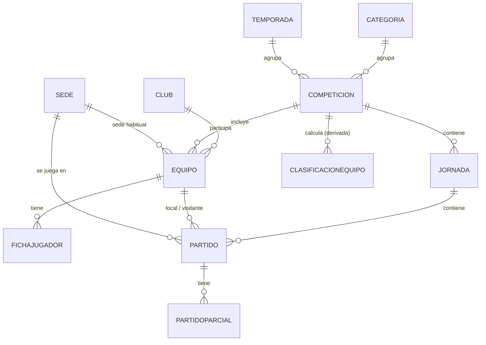

# Modelo de datos

Este fichero describe el modelo de datos de BasketBaseTracker, derivado de los requisitos descritos en [`functional.md`](./functional.md).

## Diagrama de relaciones

## Entidades catálogo (independientes de temporada)

Datos maestros reutilizables entre temporadas.

### Categoria

| Campo | Tipo | Notas |
| --- | --- | --- |
| Id | int (PK) | |
| Nombre | string | Benjamín, Alevín, Infantil, Cadete, Juvenil... |
| Orden | int | Para ordenar por edad en listados |

### Club

| Campo | Tipo | Notas |
| --- | --- | --- |
| Id | int (PK) | |
| Nombre | string | |
| Municipio | string | |
| FechaAlta | date | |

### Sede

| Campo | Tipo | Notas |
| --- | --- | --- |
| Id | int (PK) | |
| Nombre | string | Pabellón municipal |
| Municipio | string | |
| Direccion | string | |

La sede es el pabellón físico y no cambia de una temporada a otra; lo que cambia es qué equipo la usa como sede habitual, y eso se modela en `Equipo`, no aquí.

## Entidades ancladas a temporada

### Temporada

| Campo | Tipo | Notas |
| --- | --- | --- |
| Id | int (PK) | |
| Nombre | string | Ej. "2025-2026" |
| FechaInicio | date | |
| FechaFin | date | |
| Estado | enum | Planificada / EnCurso / Finalizada / Archivada |

### Competicion

| Campo | Tipo | Notas |
| --- | --- | --- |
| Id | int (PK) | |
| TemporadaId | FK → Temporada | |
| CategoriaId | FK → Categoria | |
| PuntosVictoria | int | Ej. 2 |
| PuntosDerrota | int | Ej. 1 |

- Restricción única: `(TemporadaId, CategoriaId)` — una competición por categoría y temporada.
- Es la clave de aislamiento de datos por temporada y categoría: toda la información transaccional (equipos, calendario, resultados) cuelga de aquí.

### Equipo

Representa la participación de un club en una competición concreta (no es una entidad persistente entre temporadas).

| Campo | Tipo | Notas |
| --- | --- | --- |
| Id | int (PK) | |
| CompeticionId | FK → Competicion | |
| ClubId | FK → Club | |
| Nombre | string | Ej. "CB Triana A" |
| SedeHabitualId | FK → Sede (nullable) | |
| Estado | enum | Activo / Retirado |

- Al ser propio de cada `Competicion` (y por tanto de cada temporada), no hace falta una tabla puente de "inscripción": la fila de `Equipo` **es** la participación de esa temporada.
- Permite varios equipos del mismo club en la misma categoría (A/B).
- No hay vínculo entre el `Equipo` de una temporada y el "mismo" equipo en la temporada siguiente — decisión deliberada de simplicidad recogida en `functional.md`.

### FichaJugador

Sustituye a un "Jugador" como entidad fuerte, por la decisión de no tratar datos personales (RGPD).

| Campo | Tipo | Notas |
| --- | --- | --- |
| Id | int (PK) | |
| EquipoId | FK → Equipo | |
| Dorsal | int | |
| Posicion | enum (nullable) | Base / Escolta / Alero / Ala-Pívot / Pívot |

- Restricción única: `(EquipoId, Dorsal)`.
- Sin nombre ni ningún dato identificativo — solo dorsal y posición.
- Al colgar de `Equipo` (anual), un jugador que cambia de equipo entre temporadas simplemente genera una ficha nueva; no se rastrea el cambio, tal como acepta `functional.md`.

## Calendario y resultados

### Jornada

| Campo | Tipo | Notas |
| --- | --- | --- |
| Id | int (PK) | |
| CompeticionId | FK → Competicion | |
| Numero | int | |

- Restricción única: `(CompeticionId, Numero)`.

### Partido

| Campo | Tipo | Notas |
| --- | --- | --- |
| Id | int (PK) | |
| JornadaId | FK → Jornada | |
| EquipoLocalId | FK → Equipo | |
| EquipoVisitanteId | FK → Equipo | |
| SedeId | FK → Sede (nullable) | Por defecto la sede habitual del local; permite excepciones (finales, partidos reubicados) |
| FechaHora | datetime (nullable) | Nulo si aún no está programado |
| Estado | enum | Programado / Jugado / Aplazado / Cancelado / Resuelto |
| PuntosLocal | int (nullable) | |
| PuntosVisitante | int (nullable) | |
| MotivoResolucion | enum (nullable) | Incomparecencia / AlineacionIndebida / Otro — solo si Estado = Resuelto |
| EquipoGanadorResolucionId | FK → Equipo (nullable) | Solo si Estado = Resuelto |
| Observaciones | string (nullable) | |
| RowVersion | rowversion | Control de concurrencia optimista |

Invariante de aplicación (no expresable como constraint simple de BD): un equipo no puede aparecer dos veces en la misma jornada, ni como local ni como visitante.

### PartidoParcial

Estadísticas básicas por periodo.

| Campo | Tipo | Notas |
| --- | --- | --- |
| Id | int (PK) | |
| PartidoId | FK → Partido | |
| NumeroPeriodo | int | 1-4; 5+ para prórrogas |
| PuntosLocal | int | |
| PuntosVisitante | int | |

Se modela como tabla hija en vez de columnas fijas Q1-Q4 para no forzar el número de prórrogas en el esquema.

## Clasificación

### ClasificacionEquipo (derivada, no es fuente de verdad)

Tabla de caché recalculada a partir de `Partido` cada vez que se guarda un resultado (o por job periódico), no editable directamente por un administrador.

| Campo | Tipo | Notas |
| --- | --- | --- |
| CompeticionId | FK → Competicion | |
| EquipoId | FK → Equipo | |
| PartidosJugados | int | |
| Victorias | int | |
| Derrotas | int | |
| PuntosFavor | int | |
| PuntosContra | int | |
| PuntosClasificacion | int | Calculado con `PuntosVictoria`/`PuntosDerrota` de la Competicion |
| ActualizadoEn | datetime | |

Se modela como derivada (no normalizada) porque el requisito no funcional de consistencia eventual (máximo 5 minutos) permite tratarla como una caché, y esa misma clave (`CompeticionId`) sirve como partición natural de caché para cumplir el límite de 200ms en consultas de clasificación.

## Notas de diseño

- **Aislamiento por temporada y categoría**: toda la jerarquía transaccional cuelga de `Competicion` (Temporada + Categoría), por lo que cualquier consulta pública se puede filtrar y cachear por esa clave.
- **RGPD / sin datos personales**: `FichaJugador` es deliberadamente anónima (solo dorsal y posición); no existe una entidad "Jugador" con identidad propia.
- **Integridad administrativa**: `RowVersion` en `Partido` y `Equipo` para evitar ediciones concurrentes perdidas entre administradores.
- **Simplicidad**: sin relaciones muchos-a-muchos entre temporadas; `Equipo` y `FichaJugador` son anuales por diseño.

## Pendiente de definir

- Valores exactos del enum `Posicion` y si debe ser obligatorio.
- Reglas de puntuación por defecto para partidos `Resueltos` (p. ej. marcador técnico 20-0) más allá de los puntos de clasificación.
- Política de retención/archivado de temporadas finalizadas (mencionada en `functional.md`, aún sin concretar a nivel de esquema).
